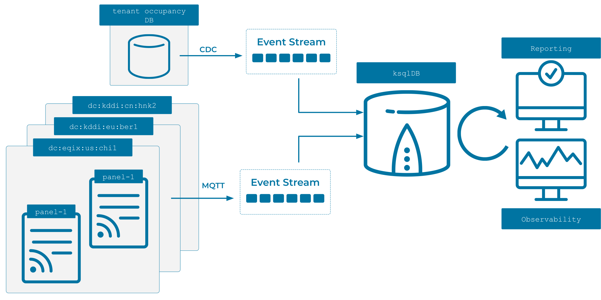

---
seo:
  title: Analyze Datacenter Power Usage 
  description: This ksqlDB recipe analyzes telemetry data from datacenter power electrical smart panels. The stream processing use cases for this data include detection of power usage levels for safety and accounting purposes.
---

# Analyze Datacenter Power Usage 

If your business provides a cloud infrastructure offering with multiple physical datacenter locations with isolated tenants, you may have an accounting unit to monitor and accurately invoice your customers.
The datacenters consume large amounts of electricity, which need to be monitored to ensure business continuity, and each datacenter is constructed with smart electrical panels that control the power supplies to multiple customer tenants.
The smart panels emit telemetry data that is captured and produced into an Apache Kafka® topic, and this recipe demonstrates how to accurately bill each customer. 



## Step by step

### Set up your environment
 
--8<-- "docs/shared/ccloud_setup.md"

### Read the data in

--8<-- "docs/shared/connect.md"

Our datacenter power analysis applications require data from two different sources: customer tenant information and smart control panel readings.

```sql
--8<-- "docs/operations/data-center/source.json"
```

--8<-- "docs/shared/manual_insert.md"

### Run the stream processing app

--8<-- "docs/shared/ksqlb_processing_intro.md"

```sql
--8<-- "docs/operations/data-center/process.sql"
```

--8<-- "docs/shared/manual_cue.md"

```sql
--8<-- "docs/operations/data-center/manual.sql"
```

### Cleanup

--8<-- "docs/shared/cleanup.md"

## Explanation

Typically, customer information would be sourced from an existing database. As customer occupancy changes, tables in the database are updated and we can stream them into Kafka using Kafka Connect with [change data capture](https://www.confluent.io/blog/cdc-and-streaming-analytics-using-debezium-kafka/). The earlier example of the `MySqlCdcSource` configuration could be used to capture changes from a `customer` database's `tenant` table into the Kafka cluster. This connector is provided as [fully managed on Confluent Cloud](https://docs.confluent.io/cloud/current/connectors/cc-mysql-source-cdc-debezium.html).  

Telemetry data may be sourced into Kafka in a variety of ways. MQTT is a popular source for the Internet of Things (IoT) devices, and smart electrical panels may provide this functionality out of the box. The [MQTT Connector](https://docs.confluent.io/cloud/current/connectors/cc-mqtt-source.html) is available as [fully managed on Confluent Cloud](https://docs.confluent.io/cloud/current/connectors/cc-mqtt-source.html).

The current state of customer tenant occupancy can be represented with a ksqlDB `TABLE`. Events streamed into the `tenant-occupancy` topic represent a customer (`customer_id`) beginning an occupancy of a particular tenant (`tenant_id`). As events are observed on the `tenant-occupancy` topic, the table will model the current set of tenant occupants. 

```sql
CREATE TABLE tenant_occupancy (
  tenant_id VARCHAR PRIMARY KEY,
  customer_id BIGINT
) WITH (
  kafka_topic='tenant-occupancy',
  partitions=3,
  key_format='JSON',
  value_format='JSON'
);
```

You can query this table to determine which customer occupies which tenant.

```sql
SELECT * FROM tenant_occupancy EMIT CHANGES;
```

When customers leave a tenant, the source system will need to send a [tombstone record](https://docs.ksqldb.io/en/latest/developer-guide/ksqldb-reference/create-table/#primary-key) (an event with a valid `tenant_id` key and a `null` value). ksqlDB will process the tombstone by removing the row with the given key from the table.

Panel sensor readings can be streamed directly into a topic or sourced from an upstream system. A `STREAM` captures the power readings when they flow from the smart panel into Kafka. Each event contains a panel identifier and the associated tenant, in addition to two power readings.

```sql
CREATE STREAM panel_power_readings (
  panel_id BIGINT,
  tenant_id VARCHAR,
  panel_current_utilization DOUBLE,
  tenant_kwh_usage BIGINT
) WITH (
  kafka_topic='panel-readings',
  partitions=3,
  key_format='JSON',
  value_format='JSON'
);
```

* `panel_current_utilization` represents the percentage of total capacity of the panel and is useful for business continuation monitoring
* `tenant_kwh_usage` provides the total amount of energy consumed by the tenant in the current month 

To provide billing reports, a `STREAM` is created that joins the panel sensor readings with the customer tenant information. Functions are used to create a billable month indicator along with the necessary fields from the joined stream and table. 

```sql
CREATE STREAM billable_power AS 
  SELECT 
      FORMAT_TIMESTAMP(FROM_UNIXTIME(panel_power_readings.ROWTIME), 'yyyy-MM') 
        AS billable_month,
      tenant_occupancy.customer_id as customer_id,
      tenant_occupancy.tenant_id as tenant_id, 
      panel_power_readings.tenant_kwh_usage as tenant_kwh_usage
    FROM panel_power_readings
    INNER JOIN tenant_occupancy ON 
      panel_power_readings.tenant_id = tenant_occupancy.tenant_id
  EMIT CHANGES;
```

Finally, the `billable_power_report` aggregates the `billable_power` stream into a `TABLE` that can be queried to create reports by month, customer, and tenant.

```sql
CREATE TABLE billable_power_report WITH (key_format='json') AS
  SELECT customer_id, tenant_id, billable_month, MAX(tenant_kwh_usage) as kwh
    FROM billable_power
    GROUP BY tenant_id, customer_id, billable_month;
```
