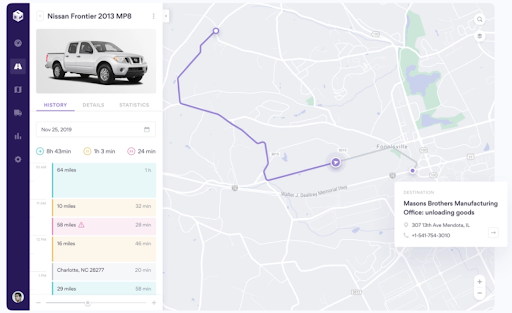

---
seo:
  title: Optimize Fleet Management
  description: This ksqlDB recipe enriches fleet location data with data about each vehicle for a real-time view of consolidated information on the entire fleet.
---

# Optimize Fleet Management

More and more, fleet management relies on knowing real-time information on vehicle availability, their locations, and integrating that with data from vehicle telematics. This enables businesses to improve operational efficiency by optimizing travel routes, lowering fuel consumption, and automating service schedules. This recipe combines fleet locations with individual vehicle information, so organizations can have a real-time consolidated view of their entire fleet.



## Step by step

### Set up your environment

--8<-- "docs/shared/ccloud_setup.md"

### Read the data in

--8<-- "docs/shared/connect.md"

```json
--8<-- "docs/predictive-analytics/fleet_management/source.json"
```

--8<-- "docs/shared/manual_insert.md"

### ksqlDB code

This application will enrich the fleet telemetry events with details about the associated vehicle.

--8<-- "docs/shared/ksqlb_processing_intro.md"

```sql
--8<-- "docs/predictive-analytics/fleet_management/process.sql"
```

--8<-- "docs/shared/manual_cue.md"

```sql
--8<-- "docs/predictive-analytics/fleet_management/manual.sql"
```

### Cleanup

--8<-- "docs/shared/cleanup.md"
