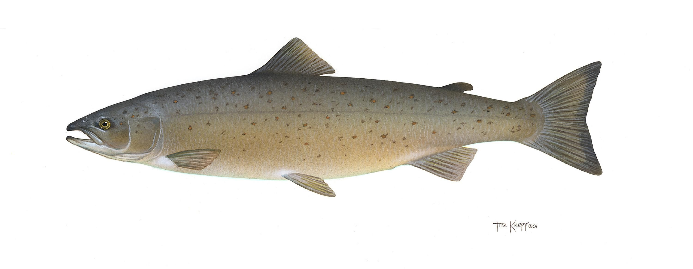

---
seo:
  title: Machine Learning Model Retraining
  description: This recipe demonstrates how to use ksqlDB to evaluate the predictions of a machine learning model and send data to retrain the model when needed.
---

# Machine Learning Model Retraining

Machine learning provides valuable insights to an organization and tools like Apache Kafka, Kafka Connect, and kslqDB allow us to build powerful machine learning pipelines. We can also use these tools to extend an existing machine learning pipeline. In this recipe we'll use Connect and ksqlDB to read the results of an existing pipeline, determine the accuracy of said results, and send data to retrain our model.



## Step by step

### Set up your environment

Provision a Kafka cluster in [Confluent Cloud](https://www.confluent.io/confluent-cloud/tryfree/?utm_source=github&utm_medium=ksqldb_recipes&utm_campaign=inventory).

--8<-- "docs/shared/ccloud_setup.md"

### Read the data in

--8<-- "docs/shared/connect.md"

The existing pipeline, which is predicting the weight of fish based on size and species, stores its results in two MongoDB collections, which are used by other processes downstream. One collection contains the data fed to the model, along with the prediction. The other contains the actual weight determined from a later step in the process. For this recipe, we'll use Connect to make this data available to our ksqlDB application.

```json
--8<-- "docs/predictive-analytics/model-retraining/source.json"
```

--8<-- "docs/shared/manual_insert.md"

### ksqlDB code

Create ksqlDB Streams for our two input topics coming from Connect, then create another stream which joins those two streams on `Fish_Id`. Finally, create a ksqlDB Table with a windowed aggregation of our joined stream where the average error rate is over 15%. This table will be used to trigger our model retraining process.
--8<-- "docs/shared/ksqlb_processing_intro.md"

```sql
--8<-- "docs/predictive-analytics/model-retraining/process.sql"
```

--8<-- "docs/shared/manual_cue.md"

```sql
--8<-- "docs/predictive-analytics/model-retraining/manual.sql"
```

### Write the data out

Now we'll use a MongoDB Sink connector to send the combined predictions and actual weights to a database and the HTTP Sink connector to trigger the retraining process.

```json
--8<-- "docs/predictive-analytics/model-retraining/sink.json"
```

### Cleanup

--8<-- "docs/shared/cleanup.md"
