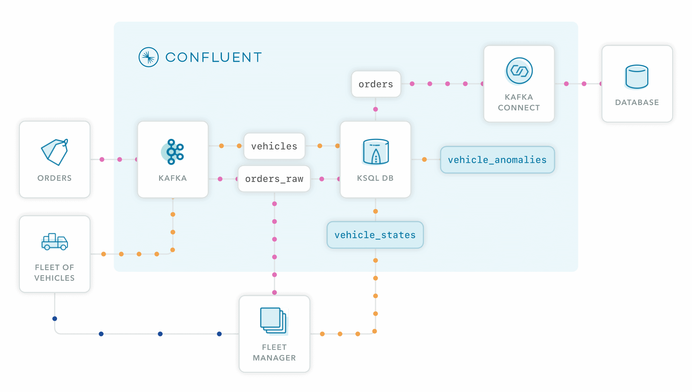

---
seo:
  title: Real-Time Delivery Logistics
  description: This recipe shows how to track vehicles while delivering orders.
---

# Real-Time Delivery Logistics

In today's world, last-mile delivery services are crucial. These operations have to operate as smoothly as possible, ensuring that customers are receiving their orders on time and that they are, ideally, provided real-time updates as the process takes place. This recipe will show your delivery service how to compute real-time 



## Step-by-step

### Setup your Environment

Provision a Kafka cluster in [Confluent Cloud](https://www.confluent.io/confluent-cloud/tryfree/?utm_source=github&utm_medium=ksqldb_recipes&utm_campaign=real_time_logistics).

--8<-- "docs/shared/ccloud_setup.md"

### Read the data in

--8<-- "docs/shared/connect.md"

For this recipe, we'll be using order data as well as a stream of status updates from a fleet of delivery vehicles that are in the process of transporting orders from a warehouse to customers. Kafka Connect can easily stream in data from a database containing that information; use the following template as a guide for setting up your connector.

```json
--8<-- "docs/real-time-analytics/logistics/source.json"
```

--8<-- "docs/shared/manual_insert.md"

### Run stream processing app

This application processes real-time vehicle information, showing the current state of the order on the vehicle –  `WAREHOUSE`, `EN ROUTE`, or `DELIVERED` – along with the distance away from the final destination and an estimated delivery time. 

--8<-- "docs/shared/ksqlb_processing_intro.md"

```sql
--8<-- "docs/real-time-analytics/logistics/process.sql"
```

--8<-- "docs/shared/manual_cue.md"

```sql
--8<-- "docs/real-time-analytics/logistics/manual.sql"
```

### Write the data out

This section is optional

```json
--8<-- "docs/real-time-analytics/logistics/sink.json"
```

### Cleanup

--8<-- "docs/shared/cleanup.md"